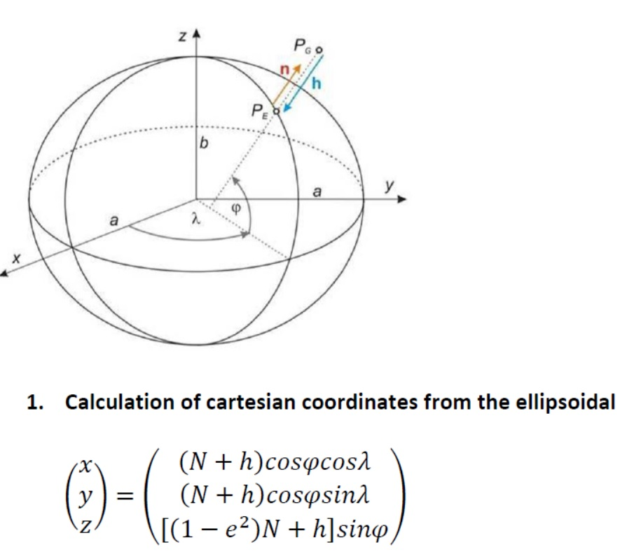
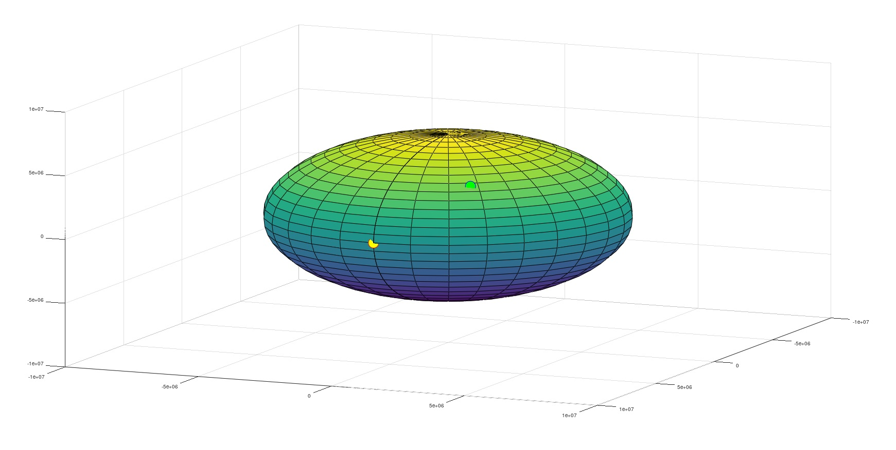

# Transformation from Orbital Frame (OR) to Conventional Terrestrial Reference Frame (CT) and Observer’s frame called Horizontal (H)

The data and information described in this repository are within the scope of the Advanced Geodesy and Geodetic Astronomy course. This course is given by **Dr. hab. inż. Wojciech Jarmołowski**. I learned a lot from him.

Calculation of the cartesian coordinates from ellipsoidal;

     

Define ellipsoidal parameters first (e.g. semi-major axis a and eccentricity e). Then we select ellipsoidal parameters of an arbitary point latitude, longitude and h (high from the ground) and recalculate them to cartesan coordinates. The Geodetic Reference System 1980 (GRS 80) is used in this project. It is a geodetic reference system consisting of a global reference ellipsoid and a normal gravity model.

In this project I used coorinates of the **Ankara/Turkey** (<code>phi1</code>, <code>lam1</code> and <code>h1</code>).

## Building Algorithm for the Project

First, we need to build **change.m** function to calculate parameters and make transformation.

    function demise = change(ddd);
    
    dgr=fix(ddd);
    min=fix((ddd-dgr)*60);
    sec=((ddd-dgr)*60-min)*60;
    demise=[dgr min sec]
    
    %save('azymut.mat');

 Now we have three cartesian coordinates(x, y, z) which can be iteratively recalculated back to three ellipsoidal parameters.

    clc
	a=6378137; % semi-major axis GRS80
	f=1/298.257222101; % flattening GRS80
	ekw=2*f-f^2; % first eccentricity GRS80
	b = a*sqrt(1-ekw);
	deg = pi / 180;
	rad = 180 / pi;
	
Iterative formulas start from the h and approximation of geodetic latitude by geocentric latitude.

	% as first approximation of ellipsoidal height - zero
	phi=39 + 52/60 + 20.176/3600;
	lam=32 +  45/60 + 42.451/3600;

	phi1 = phi * deg;
	lam1 = lam * deg;
	h1 = 100;

	N = a ./ sqrt(1 - ekw .* sin(phi1).^2);
	x = (N + h1) .* cos(phi1) .* cos(lam1);
	y = (N + h1) .* cos(phi1) .* sin(lam1);
	z = ((1 - ekw) .* N + h1) .* sin(phi1);

We calculate iteratively radius of curvature in prime vertical (N) and 2 of 3 coordinates to convergencı(4-5 iterations).

    p = sqrt(x.^2+y.^2);
    firad(1) = atan(z/p); % as 1st approximation of geodetic latitude - geocentric
    h(1) = 0;

    for i=1:5
      
      N(i) = a/sqrt(1-ekw*sin(firad(i))^2); % successive iterations of curvature radius N
      h(i+1) = p/cos(firad(i))-N(i); % successive iterations of ellipsoidal height
      firad(i+1) = atan((z/p)*(1-ekw*(N(i)/(N(i) + h(i+1))))^-1); % it. of geod. latitude
      
    end
    lastv = firad(end);
    lastv1 = lastv * rad;
    latitude = change(lastv1)
    
    h1 = h(end)
    
    longitude = change(lam)

Geodetic longitude (lambda) is calculated simply from **arctan(y/x)**. We consider quaters of full angle and therefore it is convenient to use function azimuth from previous exercises.

    figure
    [xe, ye, ze] = ellipsoid(0,0,0,a,a,b,30); % function for drawing the ellipsoid
    surf(xe, ye, ze);
    hold on
    plot3(x,y,z,'bo','MarkerSize',20,'MarkerFaceColor','g');
    hold on
    
    % yellow dot denotes zero meridian
    plot3(a,0,0,'ro','MarkerSize',20,'MarkerFaceColor','y');
    hold off

     

As we can see from the plot, yellow point is the intersection of the greenwich and equator. Green point is showing the position of Ankara.
In command window we can see the results which is coordinates of the Ankara.

Coordinates are saved via <code>fopen</code> at the end of the project as .txt file named ofile.

    fid = fopen('ofile.txt','w');
    fprintf(fid,'%14.8f %14.8f %10.3f\n', [phi1, lam1, h1]');
    fclose('all');

## Contact Me

If you have something to say to me please contact me: 

 - Twitter: [Doguilmak](https://twitter.com/Doguilmak)  
 - Mail address: doguilmak@gmail.com
